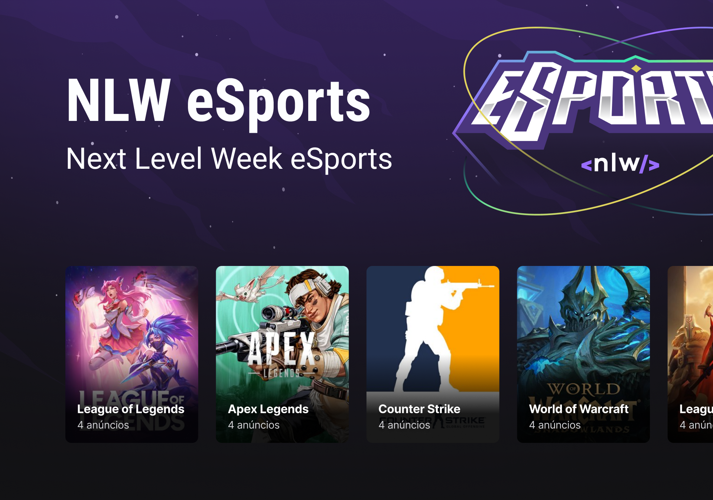

# NLW eSports Web

This project was bootstrapped with [Vite](https://vitejs.dev/).

## To test this project

In the project directory, to download the app dependencies you can run

### `npm install`

Then to start running the project run

### `npm run dev`

The app will run in the development mode.\
Open [http://127.0.0.1:5173](http://127.0.0.1:5173) to view it in your browser.

The page will reload when you make changes.\
You may also see any lint errors in the console.
